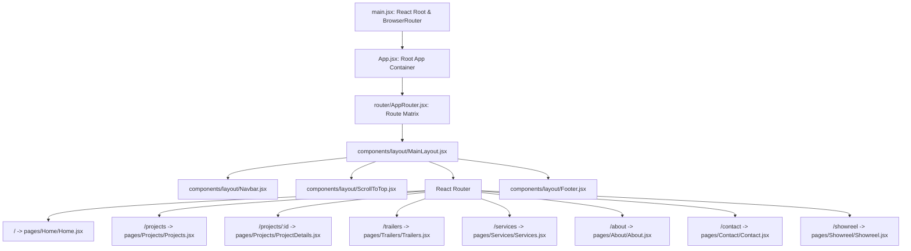
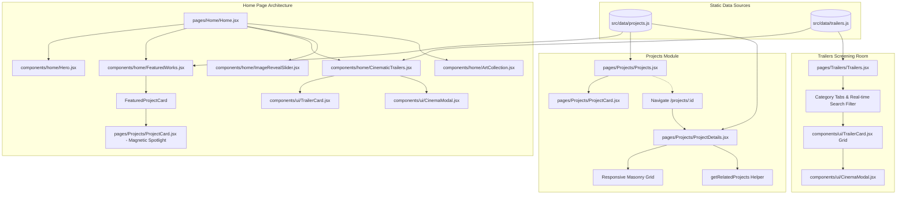
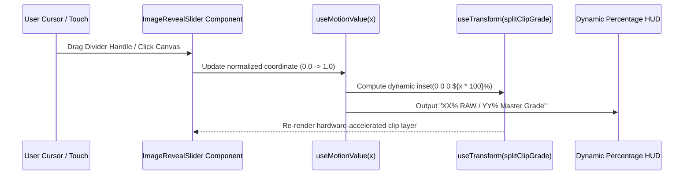

# Product Requirement Document (PRD) & Technical Architecture Specification
**Project Name:** Cinematic Portfolio (Spectra Post / Abo Hussain Studio)  
**Role:** Senior Frontend Developer & UI/UX Architect  
**Tech Stack:** React 19, Vite (Rolldown Vite), Tailwind CSS v3, Framer Motion v12, Lucide React, React Router DOM v7  
**Document Version:** 1.0.0  
**Status:** Approved & Living Technical Reference

---

## 1. Executive Summary & App Vision

### 1.1 Overall App Idea & Concept
The **Cinematic Portfolio** is an ultra-premium, dark-mode-first digital showcase built for **Mahmoud Abo Hussain / Spectra Post**, an elite cinematic colorist, post-production artist, and editorial specialist. 

Unlike traditional flat developer/designer portfolios, this web application is conceived as an **interactive cinematic screening room and look-development laboratory**. The primary objective is to immerse film directors, producers, streaming executives (e.g., Netflix, Watch IT, Shahid), and commercial agency creative directors into the artist's high-end post-production universe (ACES pipelines, Dolby Vision HDR, 8K RED RAW finishing, dynamic pacing, and editorial rhythm).

```
   +-------------------------------------------------------------------------------+
   |                             THE CINEMATIC EXPERIENCE                          |
   |                                                                               |
   |   [Theatrical Dark UI]  -->  [RAW vs Grade Slider]  -->  [Cinema Trailer Vault]  |
   |         (Space-900)             (Motion Drag/Sweep)           (Vimeo Pro Player)   |
   |              |                          |                             |       |
   |              v                          v                             v       |
   |   [Magnetic Project Cards]  -->  [Masonry Stills Grid]  -->  [Direct Studio Lead] |
   |     (Spring Physics)               (Aspect-Adaptive)           (Inquiry Intake)   |
   +-------------------------------------------------------------------------------+
```

### 1.2 Core Experience Pillars
1. **Theatrical Visual Atmosphere:** Deep space blacks (`#0d0d0d`, `#141417`), electric cinematic blue accents (`#0044ff`), subtle radial gradient spotlights, and frosted-glass modal overlays (`backdrop-blur-xl`).
2. **Interactive Color Grading Demonstration:** A split-screen comparison slider allowing directors to dynamically wipe between unprocessed RAW camera footage and final mastered color grades with real-time percentage indicators.
3. **Immersive Screening Room (Cinema Modal):** High-definition Vimeo trailer playback equipped with a theatrical backdrop, full metadata HUD (resolution, color space, audio mix), and keyboard navigation (`Esc`, `ArrowLeft`, `ArrowRight`).
4. **Fluid Spring & Magnetic Micro-Interactions:** Custom mouse-following cursor badges, spring-physics spotlights on project cards, and lazy-loading responsive masonry stills.

---

## 2. System Architecture & Tech Stack

```
+------------------------------------------------------------------------------------+
|                                 APPLICATION LAYER                                  |
|                                                                                    |
|  +--------------------+   +---------------------+   +---------------------------+  |
|  |   React 19 Core    |   | React Router DOM v7 |   | Framer Motion 12 Engine   |  |
|  | Component Tree &   |---| Route Management &  |---| Spring Physics, Motion    |  |
|  | Concurrent Mode    |   | Parametric Dynamic  |   | Values, Gesture Dragging  |  |
|  +--------------------+   +---------------------+   +---------------------------+  |
|            |                         |                            |                |
|  +--------------------+   +---------------------+   +---------------------------+  |
|  |  Tailwind CSS v3   |   | Static Data Store   |   | Lucide React Iconography  |  |
|  | Custom Tokens &    |---| Strongly Structured |---| Vector HUD & Playback     |  |
|  | Utilities          |   | JS Data Collections |   | Control Icons             |  |
|  +--------------------+   +---------------------+   +---------------------------+  |
|                                                                                    |
|                                BUNDLING & TOOLING                                  |
|  +-------------------------------------------------------------------------------+ |
|  | Vite 7 (Rolldown Engine) + PostCSS + Autoprefixer + ESLint 9 Flat Config       | |
+--+-------------------------------------------------------------------------------+--+
```

### 2.1 Dependencies & Versions
* **React `^19.1.1` & React DOM `^19.1.1`:** Core UI library with enhanced rendering performance.
* **React Router DOM `^7.9.5`:** Client-side SPA navigation, nested layouts, and route parameters.
* **Framer Motion `^12.23.26`:** Complex motion values (`useMotionValue`, `useTransform`, `useSpring`), auto-sweep loops, and exit transitions.
* **Tailwind CSS `^3.4.18`:** Utility-first CSS with bespoke color palette extensions.
* **Lucide React `^0.553.0`:** Minimalist line iconography tailored for media and playback interfaces.
* **Vite (`rolldown-vite@7.1.14`):** Next-gen build tool ensuring instant HMR and optimized production bundles.

---

## 3. Project Structure

```
cinematic-portfolio/
│
├── dist/                               # Production build output
├── public/                             # Public static assets & media
│   ├── images/                         # Project stills, hero webp files, art assets
│   │   ├── P_01/ to P_12/              # Per-project high-res stills & thumbnails
│   │   ├── hero_01.webp - hero_03.webp # Hero auto-carousel frames
│   │   ├── art_01.png - art_06.png     # Art gallery images
│   │   └── mahmoud.png                 # Artist profile photograph
│   └── vite.svg
│
├── src/                                # Main application source code
│   ├── assets/                         # Bundled assets (e.g., storyboard-image.avif)
│   │
│   ├── components/                     # Reusable UI component modules
│   │   ├── home/                       # Home page dedicated feature sections
│   │   │   ├── ArtCollection.jsx       # Expandable interactive art showcase
│   │   │   ├── CinematicTrailers.jsx   # Top 3 featured trailer reel with cinema modal
│   │   │   ├── FeaturedWorks.jsx       # Grid showcase of signature projects
│   │   │   ├── Hero.jsx                # Full-bleed cinematic carousel with smooth scroll CTA
│   │   │   ├── ImageRevealSlider.jsx   # Before/After RAW vs Master Grade wipe tool
│   │   │   └── OurProcess.jsx          # Film-strip storyboard production stages
│   │   │
│   │   ├── layout/                     # Global shell and structure
│   │   │   ├── Footer.jsx              # Studio branding, copyright & links
│   │   │   ├── MainLayout.jsx          # Root container wrapping Navbar, Outlet/Children & Footer
│   │   │   ├── Navbar.jsx              # Glassmorphic header with scroll-aware styling & mobile drawer
│   │   │   ├── ScrollToTop.jsx         # Automatic viewport scroll reset on route change
│   │   │   └── Sidebar.jsx             # Alternative navigation drawer/sidebar
│   │   │
│   │   └── ui/                         # Atomic, decoupled UI elements
│   │       ├── Button.jsx              # Reusable button with style variants
│   │       ├── CinemaModal.jsx         # Theatrical Vimeo player modal with HUD metadata
│   │       ├── expand-on-hover.jsx     # Accordion gallery component with responsive breakpoints
│   │       ├── ExpandableImageGallery.jsx # Flex-expanding card gallery
│   │       ├── ProjectCard.jsx         # Lightweight card variant
│   │       ├── SectionTitle.jsx        # Standardized section headings
│   │       ├── ServiceCard.jsx         # Post-production service offering card
│   │       ├── TrailerCard.jsx         # Video card with hover scale, play pulses & specs
│   │       └── VideoEmbed.jsx          # Responsive 16:9 iframe video wrapper
│   │
│   ├── data/                           # Structured static database & query helpers
│   │   ├── careers.js                  # Studio opportunities and recruitment data
│   │   ├── projects.js                 # Complete project catalog, stills & relationship queries
│   │   ├── services.js                 # Detailed post-production services breakdown
│   │   └── trailers.js                 # Video reel items, Vimeo IDs, and technical specifications
│   │
│   ├── lib/                            # Helper utilities and shared libraries
│   │   └── utils.js                    # Tailwind class merger (`clsx` / `twMerge`)
│   │
│   ├── pages/                          # Primary view routes
│   │   ├── About/
│   │   │   └── About.jsx               # Artist bio, grading philosophy, gear & skills
│   │   ├── Careers/
│   │   │   └── Careers.jsx             # Studio job openings view
│   │   ├── Contact/
│   │   │   └── Contact.jsx             # Interactive contact form & studio information
│   │   ├── Home/
│   │   │   └── Home.jsx                # Root landing page assembling home components
│   │   ├── Projects/
│   │   │   ├── ProjectCard.jsx         # Magnetic cursor-tracking project card
│   │   │   ├── ProjectDetails.jsx      # Individual case-study page with stills masonry
│   │   │   └── Projects.jsx            # Paginated project portfolio with slide-in animations
│   │   ├── Services/
│   │   │   ├── ExpandableGalleryDemo.jsx # Gallery demonstration component
│   │   │   ├── SeriesPage.jsx          # Episodic series post-production showcase
│   │   │   └── Services.jsx            # Studio service capabilities overview
│   │   ├── Showreel/
│   │   │   └── Showreel.jsx            # Theatrical showreel screening page
│   │   └── Trailers/
│   │       └── Trailers.jsx            # Filterable trailer gallery with search and modal player
│   │
│   ├── router/                         # Application route configuration
│   │   └── AppRouter.jsx               # Route definitions and layout binding
│   │
│   ├── App.css                         # Legacy / global App styles
│   ├── App.jsx                         # App entry wrapper
│   ├── index.css                       # Tailwind imports, custom tokens & keyframe animations
│   └── main.jsx                        # React root initialization with BrowserRouter
│
├── eslint.config.js                    # ESLint 9 modern configuration
├── index.html                          # Root HTML entry point
├── package.json                        # NPM dependencies and scripts
├── postcss.config.js                   # PostCSS plugins config (Tailwind + Autoprefixer)
├── tailwind.config.js                  # Custom theme tokens (space, sidebar, border, accent)
├── vercel.json                         # Vercel SPA routing rewrites
└── vite.config.js                      # Vite bundler configuration
```

---

## 4. Static Data Architecture & Data Models

The application utilizes clean, decoupled JavaScript data modules mimicking a headless CMS or REST/GraphQL API. This enables instant transitions to backend CMS systems (e.g., Sanity, Strapi, Contentful) with zero structural refactoring.

### 4.1 Projects Data Model (`src/data/projects.js`)

```typescript
interface TechSpecs {
  master: string;       // e.g., "8K", "4K DCI"
  colorSpace: string;   // e.g., "P3-D65", "ACEScc / Rec.709"
  hdr: string;          // e.g., "Dolby Vision", "HDR10+", "SDR"
  pipeline: string;     // e.g., "ACES 1.3", "DaVinci YRGB Color Managed"
}

interface ProjectCredit {
  role: "Director" | "DP" | "Colorist" | "Editor" | "Producer" | string;
  name: string;
}

interface Project {
  id: string;             // URL-friendly slug, e.g., "nocturne"
  title: string;          // Display title, e.g., "Nocturne"
  category: string;       // "Narrative" | "Commercial" | "Documentary" | "Music Video"
  year: string;           // e.g., "2025"
  type: string;           // e.g., "Commercial"
  heroImage: string;      // High-res widescreen banner path
  thumbnail: string;      // 16:9 card preview image path
  description: string;    // Short synopsis
  services: string[];     // e.g., ["Color", "HDR", "Finishing"]
  tags: string[];         // e.g., ["ACES", "Dolby Vision", "Grain Management"]
  metadata: string;       // Formatted metadata line, e.g., "2025 • Commercial • Color, HDR"
  overview: string;       // Detailed narrative overview of the post-production scope
  approach: string;       // Color science & editorial technical breakdown
  stills: string[];       // Array of 4K captured stills from the final timeline
  credits: ProjectCredit[];// Key crew member credits
  techSpecs: TechSpecs;   // Technical color & mastering specifications
  vimeo: string | null;   // Optional embedded Vimeo case study ID
}
```

#### Helper Functions in `projects.js`:
* `getRelatedProjects(currentProjectId: string, limit = 2): Project[]`  
  Calculates related projects by comparing shared category and overlapping service arrays.
* `getCategories(): string[]`  
  Extracts and returns sorted unique project categories.
* `getServices(): string[]`  
  Extracts and returns sorted unique post-production service tags.
* `getYears(): string[]`  
  Extracts unique production years sorted in descending order.

---

### 4.2 Trailers Data Model (`src/data/trailers.js`)

```typescript
interface TrailerSpecs {
  resolution: string;   // e.g., "4K Master", "8K Red RAW", "4K DCI"
  colorSpace: string;   // e.g., "ACES / Rec.709", "Dolby Vision HDR", "P3-D65"
  sound: string;        // e.g., "5.1 Surround", "Dolby Atmos", "Theatrical Mix"
  role: string;         // e.g., "Colorist & Trailer Finish", "Lead Colorist"
}

interface Trailer {
  id: string;             // Unique slug, e.g., "al-sofara"
  vimeoId: string;        // Vimeo video ID for embedded player, e.g., "811861466"
  title: string;          // Main title, e.g., "Al Sofara"
  subtitle: string;       // Sub-heading, e.g., "Official Ramadan Series Trailer"
  year: string;           // Release year, e.g., "2023"
  duration: string;       // Runtime string, e.g., "02:26"
  category: string;       // "Series Trailer" | "Feature Trailer" | "Teaser Promo" | "Character Spot"
  filterCategory: string; // High-level filter: "Official Trailers" | "Teasers & Spots" | "Theatrical"
  genre: string;          // Genre descriptor, e.g., "Drama / Comedy", "Action / Epic Drama"
  client: string;         // Production house or platform, e.g., "Watch IT Originals", "MBC"
  thumbnail: string;      // High-resolution Vimeo CDN poster URL
  vimeoReviewUrl: string; // Direct Vimeo review portal URL
  description: string;    // Narrative summary and color grading notes
  specs: TrailerSpecs;    // Mastering and audio delivery specs
  tags: string[];         // Searchable keywords, e.g., ["ACES", "Dolby Vision", "Sound Mix"]
}
```

---

### 4.3 About Data Model (`src/pages/About/About.jsx`)

```typescript
interface AboutData {
  hero: {
    title: string;
    description: string;
    backgroundImage: string;
  };
  profile: {
    image: string;
    name: string;
    title: string;
    bio: string;
    description: string;
    experience: string;
    projects: string;
    tools: string;
    highlights: string;
  };
  sections: Array<{
    title: string;
    description: string;
    image: string;
    cta: string;
    imagePosition: "left" | "right";
  }>;
  skills: Array<{
    category: string;
    items: string;
  }>;
}
```

---

### 4.4 Contact Data Model (`src/pages/Contact/Contact.jsx`)

```typescript
interface ContactInfo {
  heading: string;
  title: string;
  residing: {
    title: string;
    location: string;
    country: string;
  };
  stateHome: {
    title: string;
    location: string;
    country: string;
  };
  email: string;
  kakao: string;
  social: {
    linkedin: string;
    instagram: string;
  };
}

interface ContactFormData {
  firstName: string;
  lastName: string;
  email: string;
  message: string;
}
```

---

## 5. Relations Between Scripts & Component Hierarchy

### 5.1 Application Routing & Layout Flow



---

### 5.2 Component Hierarchy & Data Flow Map



---

### 5.3 Detailed Script & Data Interaction Matrix

| Source File | Imported Scripts / Assets | Exported Elements | State & Data Management |
| :--- | :--- | :--- | :--- |
| `src/main.jsx` | `react`, `react-dom/client`, `react-router-dom`, `src/App.jsx`, `src/index.css` | None (Mounts DOM) | Initializes `BrowserRouter` and mounts `App` to `#root`. |
| `src/router/AppRouter.jsx` | `react-router-dom`, `MainLayout`, `ScrollToTop`, All Page views | `AppRouter` component | Declares route definitions, binds layout wrapper. |
| `src/components/layout/Navbar.jsx` | `react-router-dom`, `lucide-react` (`Play`, `Menu`, `X`) | `Navbar` component | Tracks window `scrollY` (`>50px`) for glassmorphism transitions; mobile drawer toggle state (`isOpen`). |
| `src/components/home/Hero.jsx` | `framer-motion` (`motion`, `AnimatePresence`) | `Hero` component | `currentImageIndex` (auto-advancing interval every 5000ms), smooth scroll to `#featured-works`. |
| `src/components/home/ImageRevealSlider.jsx` | `framer-motion` (`useMotionValue`, `useTransform`, `animate`), `lucide-react` | `ImageRevealSlider` component | Normalizes position `x` (0 to 1); calculates clip paths (`inset`); runs ping-pong auto-sweep animation loop. |
| `src/components/ui/TrailerCard.jsx` | `framer-motion`, `lucide-react` (`Play`, `Clock`, `ExternalLink`) | `TrailerCard` component | Card hover state (`isHovered`), triggers parent playback handler `onPlay(trailer)`. |
| `src/components/ui/CinemaModal.jsx` | `framer-motion`, `lucide-react` (`Film`, `ExternalLink`, `X`, `ChevronLeft`, `ChevronRight`) | `CinemaModal` component | Listens to global keyboard events (`Esc`, `ArrowLeft`, `ArrowRight`); locks `document.body.style.overflow`; renders Vimeo embed iframe. |
| `src/pages/Projects/ProjectCard.jsx` | `framer-motion` (`useMotionValue`, `useSpring`), `lucide-react` | `ProjectCard` component | Calculates bounding client rect relative mouse coordinates (`mouseX`, `mouseY`); drives silky spring physics for floating title pill and radial glow spotlight. |
| `src/pages/Projects/Projects.jsx` | `src/data/projects.js`, `ProjectCard.jsx`, `framer-motion` | `Projects` component | `currentPage` (pagination: 9 items/page), `isVisible` dictionary updated via `IntersectionObserver`. |
| `src/pages/Projects/ProjectDetails.jsx` | `react-router-dom` (`useParams`, `useNavigate`), `src/data/projects.js` | `ProjectDetails` component | Looks up project by `id` parameter; calculates related projects with `getRelatedProjects`; renders stills masonry grid. |
| `src/pages/Trailers/Trailers.jsx` | `src/data/trailers.js`, `TrailerCard.jsx`, `CinemaModal.jsx` | `Trailers` component | `selectedCategory` filter, `searchQuery` string, `activeTrailerId` modal state, memoized search/filter pipeline. |
| `src/pages/Contact/Contact.jsx` | `lucide-react` (`Linkedin`, `Instagram`, `Check`) | `Contact` component | `formData`, `errors` validation state, `submitted` confirmation flag. |

---

## 6. Key Interactive Features & Technical Workflows

### 6.1 Split RAW vs Final Grade Reveal Slider (`ImageRevealSlider.jsx`)
* **Mathematical Core:** Utilizes Framer Motion's `useMotionValue(0.5)` representing the divider position across the container width $[0.0, 1.0]$.
* **Dynamic CSS Clip Path:**
  ```javascript
  const splitClipGrade = useTransform(x, (val) => `inset(0 0 0 ${val * 100}%)`);
  const splitDividerLeft = useTransform(x, (val) => `${val * 100}%`);
  ```
* **Auto-Sweep Animation Loop:** Smoothly oscillates divider between $10\%$ and $90\%$ using Framer Motion's imperative `animate()` API with easing `easeInOut` over $3.2$ seconds per stroke, immediately cancelling when user drags or hovers.



---

### 6.2 Theatrical Screening Room & Vimeo Player Pipeline (`CinemaModal.jsx`)
* **Vimeo Integration:** Embeds responsive 16:9 Vimeo player with automated URL parameter optimizations:
  ```
  https://player.vimeo.com/video/{vimeoId}?autoplay=1&badge=0&autopause=0&player_id=0&app_id=58479
  ```
* **Keyboard Hotkey Engine:**
  * `Escape` $\rightarrow$ Closes modal and restores window scroll.
  * `ArrowRight` $\rightarrow$ Triggers `onNext()` to advance to subsequent trailer in current filtered collection.
  * `ArrowLeft` $\rightarrow$ Triggers `onPrev()` to move to previous trailer.
* **Scroll Lock Handling:** Automatically toggles `document.body.style.overflow = 'hidden'` to prevent background scroll jitter during playback.

---

### 6.3 Magnetic Spotlight & Spring Floating HUD (`ProjectCard.jsx`)
* **Physical Spring Smoothing:** Uses spring parameters `{ damping: 22, stiffness: 280, mass: 0.4 }` via `useSpring(mouseX)` to eliminate cursor lag while preventing harsh snapping.
* **Radial Lighting Mask:** Paints a dynamically positioned spotlight:
  ```css
  radial-gradient(350px circle at ${spotlightPos.x}px ${spotlightPos.y}px, rgba(0, 68, 255, 0.28), transparent 70%)
  ```

---

## 7. Design System, Color Palette & Styling Tokens

### 7.1 Tailwind Theme Tokens (`tailwind.config.js`)

| Token Name | Hex Value | Semantic Purpose |
| :--- | :--- | :--- |
| `space-900` | `#0d0d0d` | Deep background baseline; pure cinematic contrast |
| `space-800` | `#141417` | Secondary surface; cards, elevated containers, input backdrops |
| `space-700` | `#1b1b1e` | Tertiary surface; button borders, hovered card backgrounds |
| `border` | `#2a2a2a` | Subtle line dividers, card strokes, framing lines |
| `accent` | `#0044ff` | Electric signature blue; glows, active states, play icons, focus rings |
| `card` | `#131313` | Specialized modal and card background |
| `sidebar` | `#0f0f0f` | Off-canvas drawer and sidebar background |

### 7.2 Typography & Hierarchy
* **Primary Fonts:** Clean, modern geometric sans-serif stack (`Inter`, `system-ui`, `-apple-system`).
* **Title Treatments:** Bold to Extra-Bold (`font-extrabold`), tight tracking (`tracking-tight`), with gradient clip text highlights (`bg-gradient-to-r from-blue-400 via-indigo-300 to-white`).

---

## 8. Screen & Route Specifications

### 8.1 Route Map & Purpose

| Route Path | View Component | Key Functionalities & UI Sections |
| :--- | :--- | :--- |
| `/` | `pages/Home/Home.jsx` | Full Hero carousel, Featured Works 4-card teaser, Cinematic Trailers top 3 reel, Interactive Image Reveal Slider, Art Collection accordion. |
| `/projects` | `pages/Projects/Projects.jsx` | Complete catalog grid, 9-item pagination, intersection-observer entrance animations, dynamic category badges. |
| `/projects/:id` | `pages/Projects/ProjectDetails.jsx` | Full-bleed hero banner, production overview, color approach, technical specs sidebar (8K, ACES, Dolby V.), masonry stills gallery, related works. |
| `/trailers` | `pages/Trailers/Trailers.jsx` | Multi-category tabs ("All", "Official Trailers", "Teasers & Spots", "Theatrical"), real-time search query engine, Cinema Modal integration. |
| `/about` | `pages/About/About.jsx` | Artist bio (Mahmoud Abo Hussain), visual storytelling philosophy, software matrix (Resolve, Premiere, After Effects), career highlights. |
| `/services` | `pages/Services/Services.jsx` | Detailed post-production services overview (Color Grading, HDR Mastering, Online Editorial, Look Development). |
| `/contact` | `pages/Contact/Contact.jsx` | Interactive inquiry intake form, real-time email regex validation, dual studio location information, direct social media links. |
| `/showreel` | `pages/Showreel/Showreel.jsx` | Dedicated theatrical showreel viewing experience. |

---

## 9. Performance, Accessibility & SEO

### 9.1 Performance Optimizations
* **Image Optimization:** Utilizes modern `.webp` formats for hero carousels and lazy loading on all project card thumbnails and stills (`loading="lazy"`).
* **Bundle Splitting:** Vite with Rolldown splits third-party motion physics (`framer-motion`) and icons (`lucide-react`) to guarantee instant initial page paint.
* **Hardware Acceleration:** All Framer Motion transformations utilize GPU-accelerated CSS properties (`transform: translate3d`, `opacity`, `clip-path`).

### 9.2 Accessibility (a11y)
* Semantic HTML5 landmark structure (`<header>`, `<main>`, `<section>`, `<footer>`, `<nav>`).
* Full keyboard accessibility for modal dialogs (`Escape` to close, `Tab` cycling, arrow key navigation).
* Explicit `aria-label` tags on icon buttons and navigation carousels.

---

## 10. Senior Developer Recommendations & Future Roadmap

```
+------------------------------------------------------------------------------------+
|                                 FUTURE ROADMAP                                     |
|                                                                                    |
|  [Phase 1: Headless CMS]  -->  [Phase 2: WebGL Shader]  -->  [Phase 3: Client Hub] |
|   Integrate Sanity /            Three.js Film Grain &        Private passworded    |
|   Strapi for instant            Real-time LUT Preview        review screening room |
|   client project updates        in browser canvas            with client approvals |
+------------------------------------------------------------------------------------+
```

1. **Headless CMS Integration:** Transition `src/data/projects.js` and `src/data/trailers.js` to Sanity.io or Strapi with an automated ISR/SSR webhook trigger.
2. **WebGL / Canvas LUT Simulator:** Build a Three.js / WebGL shader enabling live, in-browser LUT grading adjustments on uploaded reference frames.
3. **Password-Protected Client Screening Vault:** Create a dedicated `/client-review/:token` route allowing directors to leave time-coded feedback on work-in-progress grades.
4. **Automated SEO & OpenGraph Generation:** Integrate dynamic OpenGraph image rendering for each individual project case study page (`/projects/:id`).
